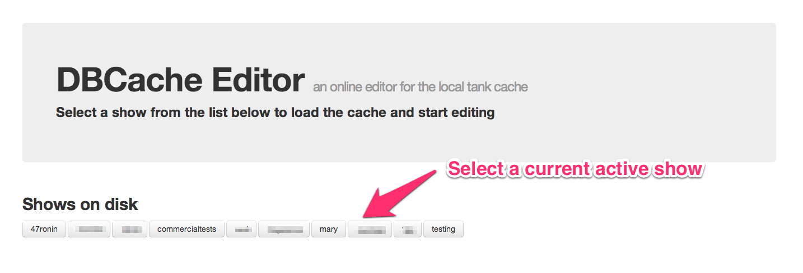
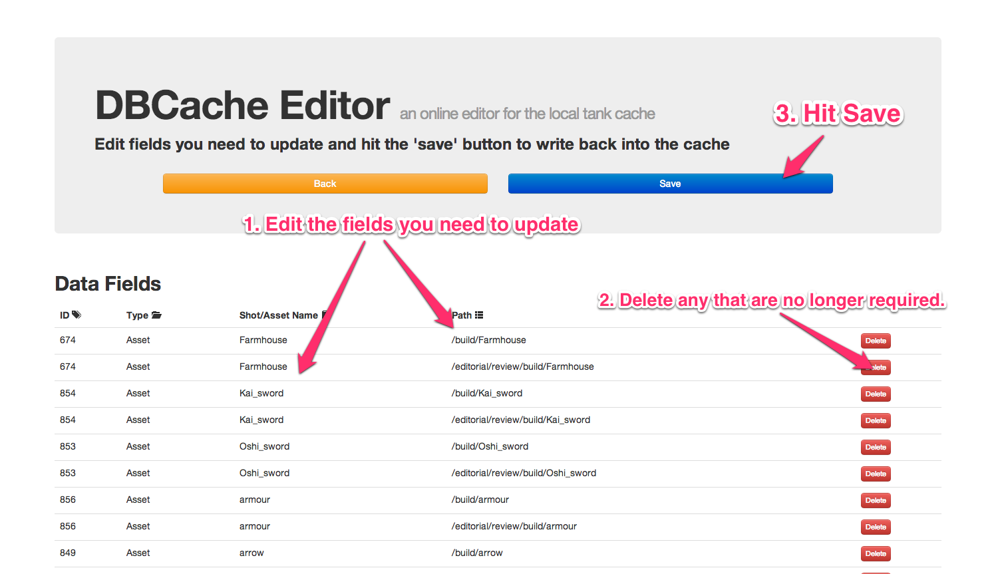
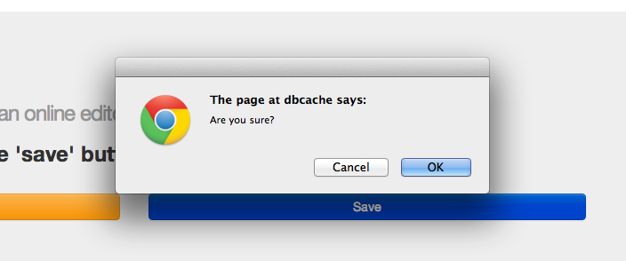

## What have you done?!?

Okay, please bare with me for long enough to explain why I've done this rather than the what.

Internally we use a localized sqlite3 database to provide caching for certain entities which we need to be able to query
quickly from within tools and apps. Access to the server where they are stored is slow and has no QoS assurance so having 
a local cache to hand is super useful.

The cache holds entity id/name/path relationships which are used by Shotgun Software's Tank asset management toolkit and most
of the time should not need any manual intervention.

Unfortunatley there is one occurance which breaks this completely. 

Shots, Assets and Sequences get renamed. When this happens the path resolution mapping stored in the cache fails and any tools
which have been built to rely on the template matching api fail.

When this we have 2 options:

1. Run create folders on the shot again to populate the cache with more records. Depending on the change made you can end up with
   multiple matches to file paths which the Tank API will complain about.

2. Delete the offending records in the cache and then follow (1) to repopulate them.

3. When time is short or there are alot of records to alter/rebuild, open the cache directly and edit the records by hand.

This web service performs the last of these options.

## Screenshots

> Select show to edit

> Edit the records you need to change

> Confirm what you are about to do.

## Notes

* This service comes with a healthy dose of "don't fuck up" because if you want to you can.
* Rolling backups are made of the db file before each edit.
* Probably won't work anywhere else.